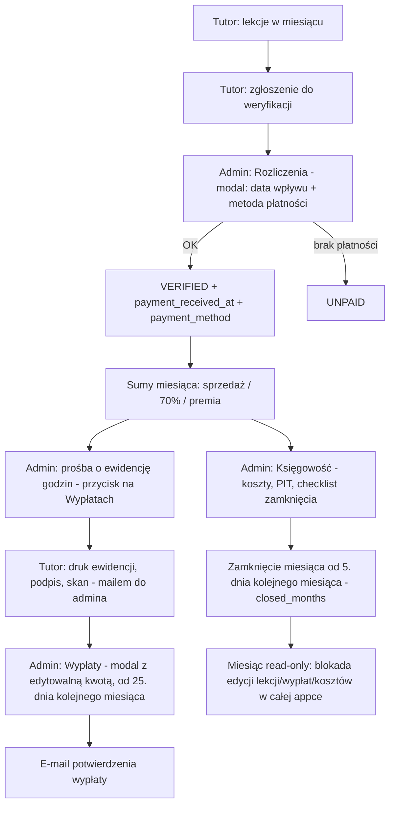

# Raport aplikacji ZALICZONE

Dokument opisuje zamysł produktu, wygląd, kolorystykę, działanie biznesowe i techniczne, stack, workflow użytkowników oraz procesy zachodzące w systemie. Stan na fazę testów / MVP wewnętrznego panelu operacyjnego - **wersja po rundzie zmian**: zamknięcie miesiąca w księgowości, metoda płatności w rozliczeniach, ręczna korekta kwoty wypłaty, usunięcie modułu powiadomień in-app (zastąpiony Przewodnikiem + mailami), przedmioty jako dropdown, redesign Dokumentów, mail powitalny w sandboxie Resend.

---

## Spis treści

1. [Zamysł produktu](#1-zamysł-produktu)
2. [Wygląd i UX](#2-wygląd-i-ux)
3. [Kolory i typografia](#3-kolory-i-typografia)
4. [Role i mapa aplikacji](#4-role-i-mapa-aplikacji)
5. [Działanie domenowe (procesy biznesowe)](#5-działanie-domenowe-procesy-biznesowe)
6. [Technologie](#6-technologie)
7. [Architektura i warstwy kodu](#7-architektura-i-warstwy-kodu)
8. [Workflow techniczny (request → dane)](#8-workflow-techniczny-request--dane)
9. [Auth, sesja, ochrona tras](#9-auth-sesja-ochrona-tras)
10. [Działanie poszczególnych narzędzi i modułów](#10-działanie-poszczególnych-narzędzi-i-modułów)
11. [Modele danych (tabele / byty)](#11-modele-danych-tabele--byty)
12. [Seedy i środowisko deweloperskie](#12-seedy-i-środowisko-deweloperskie)
13. [Konfiguracja biznesowa (`lib/dates.ts`)](#13-konfiguracja-biznesowa-libdatests)
14. [Skills / tooling AI w repo](#14-skills--tooling-ai-w-repo)
15. [Ograniczenia fazy testów](#15-ograniczenia-fazy-testów)

---

## 1. Zamysł produktu

**ZALICZONE** to wewnętrzna aplikacja webowa do prowadzenia placówki / agencji korepetycji. Nie jest to marketplace dla uczniów - to **panel operacyjny** dla:

- **admina** (biuro / właściciel placówki),
- **korepetytorów (tutorów)** zatrudnionych lub współpracujących z placówką.

### Problem, który rozwiązuje

Bez systemu procesy wyglądają typowo chaotycznie: Excel z lekcjami, przelewy „na oko”, skany ewidencji na mailu, brak wspólnego cennika, niejasne kto ile zarobił. ZALICZONE spina to w jeden przepływ:

1. Tutor planuje lekcje i uczniów.
2. Po lekcji zgłasza ją do weryfikacji płatności.
3. Admin potwierdza wpływ od klienta - podaje **datę wpływu i metodę płatności** - albo oznacza brak płatności.
4. Na podstawie zatwierdzonych lekcji liczone są wypłaty (70% stawki klienta + ewentualna premia); admin może **ręcznie skorygować** finalną kwotę przed oznaczeniem „wypłacone”.
5. Admin **zamyka miesiąc** w księgowości - od tego momentu dany miesiąc jest zablokowany na edycję (lekcje, wypłaty, koszty) w całej aplikacji.
6. Obok tego: dokumenty (dysk firmowy/tutora), ewidencje do druku, księgowość miesięczna z szacunkiem PIT, komunikacja wyłącznie mailowa (Resend) + zakładka „Przewodnik” u tutora z terminami.

### Model biznesowy w aplikacji

- Klient płaci **pełną stawkę** lekcji (zależną od poziomu / cennika i czasu trwania).
- **Tutor otrzymuje 70%** (`TUTOR_SHARE = 0.7`).
- **Agencja zatrzymuje ~30%** jako marżę.
- Dodatkowo tutor może dostać **premię 100 zł** za ≥ **40 godzin** lekcji `VERIFIED` w miesiącu.
- Wyliczona kwota wypłaty jest **domyślną propozycją** - admin może ją nadpisać ręcznie w momencie zatwierdzania przelewu (np. korekta o grosze / dodatkowe uzgodnienia poza systemem); to, co zostanie zapisane, wchodzi do kosztów w Księgowości.

### Język i branding

- UI w całości po polsku (`lang="pl"`).
- Nazwa produktu w metadata: **ZALICZONE**, opis: „Panel korepetytora”.
- Logotyp renderowany fontem **Poppins** (pogrubiona kursywa) - `lib/logo-font.ts`.

### Faza projektu

Repo jest w **fazie testów**. Schemat bazy żyje w projekcie Supabase; w repo obecnie znajduje się tylko jedna migracja SQL (`supabase/migrations/0006_payment_method.sql` - dodaje `lessons.payment_method`). Wcześniejsze migracje (schema bazowa, `closed_months`, `operating_expenses`, dokumenty) zostały już zaaplikowane na żywej bazie Supabase, ale ich plików SQL nie ma już w repo - patrz [§15](#15-ograniczenia-fazy-testów). Seedy (`seed:battle` itd.) służą do wypełniania realistycznymi danymi demo.

---

## 2. Wygląd i UX

### Charakter wizualny

Aplikacja wygląda jak **wewnętrzny panel operacyjny**, nie landing marketingowy - świadomie odważny, „ledger, ale głośniejszy”, nie minimalistyczny SaaS:

- jasne tło „lodowe” (`luster`) na obszarze roboczym,
- **ciemnogranatowy sidebar** (`#000C4A`) z limonkowym logo i aktywnym stanem menu (`bg-lime`),
- pas KPI (`LedgerBand`/`LedgerStat`) - odwrócony blok granatowy z wielkimi liczbami mono i kolorowym podkreśleniem (lime/butter/claret) - sygnaturowy element widoczny na Głównej, Wypłatach, Księgowości,
- limonkowy akcent (CTA, aktywne stany, sukces),
- kremowy / maślany (`butter`) akcent uzupełniający - ostrzeżenia „drugoplanowe” (do zatwierdzenia, koszty),
- bordowy `claret` - wyłącznie sygnał negatywny/pilny (nieopłacone, po terminie),
- zaokrąglenia paneli (`rounded-app` ≈ 1.125rem),
- osobna typografia panelu: nagłówki/etykiety **Space Grotesk** (`.dash-sans`), liczby **IBM Plex Mono** (`.dash-mono`, tabular-nums) - `lib/dashboard-fonts.ts`,
- kolorowe lewe „szyny” statusu (`.status-rail`, 6px) na wierszach/kartach - lime = zatwierdzone, butter = do zatwierdzenia/oczekujące, claret = nieopłacone,
- dużo list, kart nauczycieli, tabel statusów, checklist i widoków „do druku”.

### Layout ogólny

Dwa shell'e nawigacyjne:

| Rola | Shell | Plik |
|------|--------|------|
| Tutor | Sidebar lewy + treść | `components/app-shell.tsx` |
| Admin | Sidebar lewy (zwijany) + treść | `components/admin/admin-layout-client.tsx` |

Wyjątki **bez chrome** (pełny obszar roboczy / druk):

- `/login`
- `/finanse/ewidencja` (ewidencja godzin do druku)
- `/admin/ksiegowosc/ewidencja` (ewidencja sprzedaży)
- `/admin/ksiegowosc/koszty` (zestawienie kosztów)

Logika wyboru shella: `components/app-root.tsx` (m.in. `LessonCompletionProvider`, toasty).

### Sidebar admina - mobile + zwijanie

`AdminLayoutClient` obsługuje trzy stany szerokości/urządzenia:

- **Desktop rozwinięty** (`18rem`) i **zwinięty** (`4.5rem`, tylko ikony + tooltip przy hover) - stan trwały w cookie `admin_sidebar_collapsed`.
- **Mobile** (`< 1024px`) - sidebar jako **slide-over drawer** z overlayem, otwierany przyciskiem hamburgera (granatowy, limonkowa ikona) w nagłówku strony; zamyka się po kliknięciu linku lub tła.
- `ConfirmDialog` (potwierdzenia krytycznych akcji) renderuje się jako **bottom sheet** na mobile, jako wyśrodkowany modal na desktopie.

### Panel tutora - nawigacja

1. **Dashboard** (`/`) - tydzień lekcji, mini-kalendarz, skróty uczniów / **Przewodnika** / finansów, pasek premii.
2. **Terminarz** (`/terminarz`) - pełne zarządzanie lekcjami.
3. **Uczniowie** (`/uczniowie`).
4. **Przewodnik** (`/przewodnik`) - harmonogram terminów, instrukcje krok po kroku, dane firmowe.
5. **Finanse** (`/finanse`).
6. **Profil** (`/profil`).

`/kalendarz` przekierowuje na `/terminarz`. Zakładki „Powiadomienia” **nie ma** - usunięta w całości.

### Panel admina - nawigacja

1. **Główna** (`/admin`) - KPI finansowe, kolejki (oczekujące / nieopłacone), checklisty terminów.
2. **Rozliczenia** (`/admin/rozliczenia`) - weryfikacja płatności lekcji (data wpływu + metoda płatności).
3. **Wypłaty** (`/admin/wyplaty`) - z ręczną korektą kwoty przy oznaczaniu „wypłacone”.
4. **Księgowość** (`/admin/ksiegowosc`) - z zamknięciem miesiąca.
5. **Nauczyciele** (`/admin/nauczyciele`, profil `/admin/nauczyciele/[id]`).
6. **Cennik i przedmioty** (`/admin/cennik`).
7. **Dokumenty** (`/admin/dokumenty`) - dysk firmowy / nauczycieli.

`/admin/premie` jest redirectem do Nauczycieli (premie pokazane na kartach / w wypłatach). Zakładki „Powiadomienia” **nie ma** - usunięta w całości.

### Wzorce UI

- **Statusy lekcji** jako badge (`components/lesson/lesson-status-badge.tsx`).
- **Month / week navigator** - wspólne komponenty okresów.
- **Toast** - feedback akcji (w tym kind `bonus`).
- **Bonus progress bar** - wizualny postęp do 40 h.
- **`ConfirmDialog`** (`components/ui/confirm-dialog.tsx`) - współdzielony modal potwierdzenia dla krytycznych akcji (oznacz wypłacone, zatwierdź płatność, zamknij miesiąc…), obsługuje opcjonalną treść (`children`) - np. edytowalny input kwoty albo select metody płatności - plus stan sukcesu z animacją.
- Widoki print: minimalne, bez sidebara, pod `window.print` / PDF przeglądarki.
- Animacje celowe (nie dekoracyjny szum):
  - `hop-to-paid` - „przeskok” wiersza w rozliczeniach,
  - `add-tutor-success-pop` - potwierdzenie dodania nauczyciela,
  - `row-confirm-pulse` - pulsujące podświetlenie wiersza po potwierdzeniu.

### Dashboard admina (kompozycja)

Pierwszy ekran admina jest świadomie **gęsty operacyjnie**:

- pas KPI (`LedgerBand`): przychód VERIFIED, koszty wypłaty/wszystkie, marża agencji (lime), nieopłacone (claret jeśli > 0),
- drugi rząd: nauczyciele / uczniowie / podział lekcji (do zatw. / zatw. / nieopł., kolorowe szyny),
- trzeci: deadline'y (ewidencja, wypłaty, zamknięcie miesiąca) - kolorowa szyna: claret = po terminie, butter = nadchodzący,
- poniżej checklisty („Nowy pracownik”, „Proces wypłat”) i kolejki do ogarnięcia.

To nie jest landing - to centrum sterowania miesiąca.

---

## 3. Kolory i typografia

Źródło tokenów: `app/globals.css` (`@theme` Tailwind CSS 4).

### Paleta nazwana

| Token | Hex / wartość | Rola |
|-------|----------------|------|
| `depths` / `royal` | `#000c4a` | Navy marki: tekst, sidebar, ciężkie UI |
| `luster` | `#ebeffe` | Tło aplikacji (lodowy błękit) |
| `butter` | `#f7e9ad` | Krem / maślany akcent - drugoplanowy/neutralny sygnał |
| `lime` | `#d7fe51` | Limonka - CTA, aktywne, „sukces / zatwierdzone / marża” |
| `snow` | `#ffffff` | Biel paneli / kart |
| `steel` | `#b1b9d1` | Obramowania, scrollbary, elementy drugoplanowe |
| `muted` | `#5a6278` | Tekst pomocniczy |
| `aster` / `habanero` | `#8f97b0` | Szaro-niebieski UI |
| `taupe` | mix luster+steel | Powierzchnie pośrednie |
| `jodhpur` | mix luster+white | Jasne powierzchnie |
| `sage` | `#c8cedd` | Delikatne tła |
| `panel-frame` | `#889acc` | Ramki paneli |
| `claret` | `#8a1f2f` | **Ujemne / nieopłacone / po terminie** - sygnał negatywny |
| `moss` | `#1f5c3e` | **Dodatnie / zatwierdzone / marża** - ink dla wartości „lime” |
| `toffee` | `#8a6a1f` | **Uwaga / koszty / do zatwierdzenia** - ink dla wartości „butter” |

Komentarz w CSS: *krem · limonka · biel · lodowy · stal* - to jest świadoma tożsamość wizualna (nie „fioletowy SaaS” ani cream+terracotta). `claret`/`moss`/`toffee` to dodatkowe „inki” statusów liczbowych, czytelne na `snow`/`luster`.

### Typografia

| Rola | Font |
|------|------|
| Logotyp | **Poppins** 700/800, italic (`next/font/google`) |
| Body / UI (tutor + ogólne) | system-ui / SF Pro / Segoe UI / sans-serif |
| Panel admina - nagłówki/etykiety | **Space Grotesk** (`.dash-sans`, `lib/dashboard-fonts.ts`) |
| Panel admina - liczby/kwoty/godziny | **IBM Plex Mono** (`.dash-mono`, tabular-nums) |

Body ogólne jest celowo systemowe (czytelność panelu tutora), charakter marki siedzi w logo Poppins, a panel finansowy admina ma własną, „inżynierską” typografię (Space Grotesk + IBM Plex Mono) dla kontrastu i wagi liczb.

### Zaokrąglenia i detale

- Utility `rounded-app` → `border-radius: 1.125rem`; `rounded-ledger` → `0.375rem` (ostrzejsze rogi pasa KPI).
- `.status-rail` - lewa kolorowa „szyna” (6px) na wierszach/kartach statusu: `-verified` (lime), `-pending` (butter), `-unpaid` (claret), `-neutral` (panel-frame).
- Scrollbary: ukryte (`.scrollbar-hide`) lub cienkie stalowe (`.scrollbar-panel`).

---

## 4. Role i mapa aplikacji

### Role (`profiles.role`)

| Rola | Dostęp |
|------|--------|
| `ADMIN` | `/admin/*`; middleware z `/` przerzuca na `/admin` |
| `TUTOR` | panel tutora; wejście na `/admin/*` → redirect `/` |

### Trasy tutora

| Route | Cel |
|-------|-----|
| `/login` | Logowanie |
| `/` | Dashboard |
| `/terminarz` | Lekcje |
| `/uczniowie` | Uczniowie tutora |
| `/przewodnik` | Terminy, instrukcje krok po kroku, dane firmowe (NIP, adres) |
| `/finanse` | Finanse tutora (udział 70%, wypłaty, ewidencja) |
| `/finanse/ewidencja?month=` | Druk ewidencji godzin |
| `/profil` | Dane, przedmioty (dropdown), dokumenty |

### Trasy admina

| Route | Cel |
|-------|-----|
| `/admin` | Dashboard operacyjny |
| `/admin/rozliczenia` | PENDING → VERIFIED (data wpływu + metoda płatności) / UNPAID |
| `/admin/wyplaty` | Wypłaty miesiąca + premie + ręczna korekta kwoty |
| `/admin/ksiegowosc` | Sprzedaż, koszty, PIT, zamknięcie miesiąca |
| `/admin/ksiegowosc/ewidencja` | Druk ewidencji sprzedaży (data sprzedaży / wpływu / metoda płatności) |
| `/admin/ksiegowosc/koszty` | Druk kosztów |
| `/admin/nauczyciele` | Lista + tworzenie kont |
| `/admin/nauczyciele/[id]` | Profil nauczyciela |
| `/admin/cennik` | Stawki + wnioski o przedmioty |
| `/admin/dokumenty` | Dysk dokumentów (firmowy / nauczycieli) |

Zakładki `/admin/powiadomienia` i `/powiadomienia` **nie istnieją** - usunięte razem z modułem powiadomień in-app.

---

## 5. Działanie domenowe (procesy biznesowe)

### 5.1 Cykl życia lekcji

Statusy (`LessonStatus`):

```
PLANNED → PENDING_VERIFICATION → VERIFIED
                               ↘ UNPAID → (tutor może znów zgłosić → PENDING)
```

| Status | Znaczenie | Kto zmienia |
|--------|-----------|-------------|
| `PLANNED` | Zaplanowana | Tutor tworzy / edytuje |
| `PENDING_VERIFICATION` | Oczekuje potwierdzenia płatności od klienta | Tutor zgłasza (toggle) |
| `VERIFIED` | Płatność potwierdzona; lekcja „zamknięta” finansowo | Admin zatwierdza (modal: data wpływu + metoda płatności) |
| `UNPAID` | Brak płatności | Admin odrzuca |

**Kwota lekcji:** `rate_pln × (czas_minut / 60)`.

**Udział tutora:** `kwota × 0.7`.

W UI tutora finanse pokazują **tylko udział tutora**, nie pełną kwotę klienta.

**Zatwierdzanie (VERIFIED) wymaga modalu** (`ConfirmDialog` w `rozliczenia-client.tsx`) z dwoma polami:
- **Data wpływu** (`payment_received_at`) - zablokowana po zatwierdzeniu,
- **Metoda płatności** (`payment_method`) - wybór z listy `lib/payment-methods.ts`: *Przelew tradycyjny, BLIK, Przelewy24, Gotówka*; pole wymagane (brak wyboru = błąd walidacji w modalu, akcja się nie wykonuje).

Akcja `adminVerifyLesson(lessonId, paymentReceivedAt, paymentMethod)` zapisuje oba pola do `lessons`; ma wbudowany fallback (jeśli kolumna `payment_method` jeszcze nie istnieje w bazie - patrz [§15](#15-ograniczenia-fazy-testów) - zapisuje bez niej, żeby nie wywalić całej akcji).

### 5.2 Proces miesiąca (high-level)



### 5.3 Ewidencja godzin

- Deadline: **do 3. dnia następnego miesiąca** (np. czerwiec → do 3 lipca). Widoczny dynamicznie w zakładce **Przewodnik** u tutora (`guideDeadlines()` w `lib/dates.ts`) - kolor `claret`, jeśli termin już minął.
- Admin wysyła prośbę (`requestEwidencjaForMonth`, przycisk „Poproś o ewidencję” na `/admin/wyplaty`) → odblokowanie miesiąca na profilu tutora (`ewidencja_unlocked_for_month`) + e-mail.
- Tutor generuje widok druku `/finanse/ewidencja?month=YYYY-MM` (agregacja godzin po dniach), podpisuje, odsyła skan **mailem** do admina (brak modułu inbox - patrz §5.9).

### 5.4 Wypłaty

- Składniki: suma udziałów 70% z lekcji VERIFIED + premia (0 lub 100 zł) = domyślnie wyliczona `tutorPayoutPln`.
- Kliknięcie **„Wypłacone”** otwiera `ConfirmDialog` z polem numerycznym **„Kwota do wypłaty (można skorygować)”**, wstępnie wypełnionym wyliczoną kwotą - admin może ją zmienić ręcznie.
- Kliknięcie „Zatwierdź przelew” wywołuje `markPayoutPaid(tutorId, month, finalAmount, meta)` - zapisuje **ostateczną, ewentualnie skorygowaną** kwotę do `payouts.amount`; to pole jest tym, co Księgowość sumuje jako koszt wypłat.
- Rekord `payouts` (m.in. `amount`, `lessons_amount`, `bonus_amount`, `lesson_count`, status).
- Server-side guard: `markPayoutPaid` zaczyna od `assertMonthOpen(month)` - jeśli miesiąc jest zamknięty (`closed_months`), akcja natychmiast rzuca błąd, niezależnie od tego, skąd została wywołana.
- Admin może oznaczać wypłatę jako wykonaną od **25. dnia** miesiąca następnego względem rozliczanego.
- Po oznaczeniu: e-mail potwierdzenia (Resend, w trybie sandbox - patrz §5.9).
- UI uwzględnia konto bankowe / brak rachunku z profilu.

### 5.5 Premie

- Próg: **40 h** lekcji `VERIFIED` w miesiącu.
- Kwota: **+100 zł** do wypłaty.
- Wizualizacja: `BonusProgressBar` na dashboardzie tutora i kartach nauczycieli u admina; opis progu też w zakładce **Przewodnik**.
- Osobna zakładka Premie została usunięta (redirect `/admin/premie` → `/admin/nauczyciele`).

### 5.6 Cennik i przedmioty

- `price_tiers` - poziomy stawek (np. SP / średnia / matura) z kwotą klienta i pochodną dla pracownika (~70%).
- Zapis cennika (replace-all) + opcjonalne powiadomienie mailowe o zmianie cennika (`notifyCennikUpdate` → `sendCennikUpdateEmail`).
- **Przedmioty jako dropdown** - kanoniczna lista w `lib/subjects.ts` (Matematyka, Fizyka, Chemia, Chemia organiczna, Biologia, Angielski, Niemiecki, Hiszpański, Francuski, Polski, Historia, WOS, Geografia, Informatyka). Używana przez:
  - `components/admin/subject-multi-select.tsx` - multi-select (plakietki) przy tworzeniu/edycji konta nauczyciela,
  - profil tutora (`app/profil/profil-client.tsx`) - `<select>` przy składaniu **wniosku o przedmiot** (filtruje przedmioty już aktywne/oczekujące).
- Tutor może złożyć **wniosek o przedmiot** (`subject_requests`); admin akceptuje (dopisuje do `active_subjects`) lub odrzuca.

### 5.7 Dokumenty (dysk)

Model Google Drive–like, po refaktorze na mniejsze komponenty:

- scope `COMPANY` („Dysk firmowy”) i `TUTOR` („Dysk nauczyciela”), rozróżnione zakładkami w UI,
- foldery + pliki w Storage Supabase (bucket `documents`),
- przy tworzeniu konta tutora: automatyczny root folder (`ensureTutorRootFolder`); `syncMissingTutorRootFolders` dogania istniejące konta bez folderu,
- drzewo folderów wydzielone do komponentów `components/admin/documents/folder-row.tsx` (otwórz / drop / usuń) i `file-row.tsx` (podgląd / usuń) - czytelniejsza hierarchia niż w poprzedniej, monolitycznej wersji `dokumenty-client.tsx`,
- drag-and-drop, rename, nawigacja drzewem, podpisane URL-e (signed URL) do pobierania plików.

Tutor widzi swoje dokumenty + pliki firmowe (read-only) w **Profilu**; admin zarządza całością w **Dokumentach**.

### 5.8 Księgowość i zamknięcie miesiąca

Moduł miesięczny admina, sterowany parametrem `?month=YYYY-MM` (domyślnie: poprzedni miesiąc):

- sprzedaż = suma lekcji `VERIFIED`,
- koszty wypłat = suma `payouts` ze statusem `PAID` (czyli finalne, ewentualnie ręcznie skorygowane kwoty - §5.4),
- koszty operacyjne (`operating_expenses`) z załącznikami - CRUD tylko gdy miesiąc otwarty,
- podstawa opodatkowania = przychód − (koszty wypłat + koszty operacyjne),
- szacunek PIT (`ADMIN_PIT_RATE = 0.12` × podstawa),
- zysk netto = podstawa − PIT.

**Miesiąc otwarty** - pełny widok: przełącznik miesiąc/rok, zestawienie roczne, kalkulator ZUS „Zrób to sam” (wybór progu ZUS), i **kreator zamknięcia miesiąca** na dole z trzema warunkami liczonymi na żywo:
1. żadna lekcja w miesiącu nie ma statusu `PLANNED`/`PENDING_VERIFICATION`,
2. wszystkie `payouts` za miesiąc mają status `PAID`,
3. checkbox „potwierdzam zgodność salda z kontem bankowym” (lokalny, tylko UI).

Przycisk zamknięcia jest aktywny tylko gdy wszystkie trzy warunki są `true` **i** minęła data `canCloseMonth` (od 5. dnia kolejnego miesiąca). Server Action `closeMonth(month)` **rewalidauje warunki 1–2 po stronie serwera** (nie ufa checkboxom z UI) w `assertMonthCloseable`, zanim zapisze rekord do `closed_months`.

**Miesiąc zamknięty** - widok zmienia się w „ukończony etap”, nie tylko badge:
- przełącznik miesiąc/rok, zestawienie roczne i kalkulator ZUS „Zrób to sam” są **całkowicie ukryte**,
- kreator zamknięcia zastąpiony sekcją **„Miesiąc zamknięty - ukończony etap”** z ikoną kłódki i zarchiwizowanymi finalnymi liczbami (`ClosedFigure`): przychód, wypłaty, koszty, podstawa, PIT, ZUS, zysk netto,
- **ZUS jest zawsze zablokowany na „Ulga na start”** (~410 zł/mies.) - inne progi ZUS (np. „Mały ZUS Plus”) nie są wybieralne dla zamkniętych miesięcy,
- dodawanie/usuwanie kosztów operacyjnych zablokowane,
- linki do druku ewidencji i kosztów (PDF) **zostają aktywne**.

**Globalna ochrona danych historycznych** - niezależnie od widoku, z którego przychodzi akcja, każda mutacja dotykająca zamknięty miesiąc jest blokowana server-side przez `assertMonthOpen(monthKey)` (`lib/actions/guards.ts`): sprawdza istnienie wiersza w `closed_months`, jeśli tak → `throw new Error("Ten miesiąc jest już zamknięty - modyfikacja zabroniona")`. Objęte tym guardem: `adminVerifyLesson`, `adminRejectLessonPayment`, `markPayoutPaid`, `createOperatingExpense`, `deleteOperatingExpense`, oraz mutacje lekcji tutora w `lib/actions/lessons.ts`.

### 5.9 Komunikacja

Wyłącznie **e-mail (Resend)** - moduł powiadomień in-app został **całkowicie usunięty** (brak inboxa, brak tabeli wiadomości w dashboardach, brak zakładek „Powiadomienia”). Zastąpiony:
- zakładką **Przewodnik** (`/przewodnik`) u tutora - harmonogram terminów czytany z `lib/dates.ts`, instrukcje krok po kroku, dane firmowe,
- skrótem terminów na dashboardzie tutora (`components/dashboard/guide-shortcut-panel.tsx`) z linkiem „Otwórz przewodnik”.

Funkcje mailowe (`lib/emails/send.ts`): `sendTutorWelcomeEmail`, `sendEwidencjaRequestEmail`, `sendPayoutConfirmationEmail`, `sendCennikUpdateEmail`.

**Tryb sandbox** (`SANDBOX_MODE = true`, na czas braku zweryfikowanej domeny w Resend):
- `FROM`: `ZALICZONE <onboarding@resend.dev>` (w produkcji: `ZALICZONE <powiadomienia@zaliczone.pl>`),
- **wszystkie maile, niezależnie od zamierzonego odbiorcy, trafiają na `voj.torres9@gmail.com`** (jedyny zweryfikowany adres na koncie Resend) - `resolveRecipients()` przekierowuje `to` i dopisuje zamierzonego odbiorcę do tematu maila, żeby dało się rozpoznać, kogo dany mail „miał” dostać,
- mail powitalny dla nowego tutora **nie pokazuje tymczasowego hasła** w treści (względy bezpieczeństwa) - informuje, że dane logowania przekaże administrator.

Bez `RESEND_API_KEY` wysyłka jest pomijana (warn w logach) - UI działa dalej.

---

## 6. Technologie

| Warstwa | Wybór | Uwagi |
|---------|-------|-------|
| Framework | **Next.js 16.1.6** (App Router) | `next dev --webpack` |
| UI | **React 19.2.3** | Server + Client Components |
| Język | **TypeScript 5** | alias `@/*` |
| Style | **Tailwind CSS 4** | tokeny w `globals.css` |
| Auth / DB / Storage | **Supabase** | `@supabase/ssr` + `@supabase/supabase-js` |
| E-mail | **Resend** | sandbox mode - patrz §5.9 |
| Pakiety | **pnpm** | `pnpm-lock.yaml` |
| Lint | ESLint + `eslint-config-next` | |
| Fonty | Poppins (logo), system-ui (body), Space Grotesk + IBM Plex Mono (panel admina) | `next/font/google` |

### Zmienne środowiskowe (typowo `.env.local`)

| Zmienna | Potrzebna do |
|---------|----------------|
| `NEXT_PUBLIC_SUPABASE_URL` | klient, middleware, seedy |
| `NEXT_PUBLIC_SUPABASE_ANON_KEY` | browser + server anon |
| `SUPABASE_SERVICE_ROLE_KEY` | seedy, admin Auth, operacje omijające RLS |
| `RESEND_API_KEY` | e-maile (opcjonalnie, sandbox i tak wymuszony) |

### Co NIE jest w stacku (świadomie / na teraz)

- Brak ORM (bezpośrednie query Supabase).
- Brak osobnego backendu Node poza Next server actions.
- Migracje SQL **prawie nie są w repo** - tylko `0006_payment_method.sql`; resztę schematu trzeba odtworzyć z żywego projektu Supabase (dump), nie z gita.
- Brak `package-lock.json` (npm) - tylko pnpm.
- Brak modułu powiadomień in-app (usunięty świadomie na rzecz e-maila + Przewodnika).

---

## 7. Architektura i warstwy kodu

```
app/                     # Route'y Next (pages + admin clients + print views)
components/              # Shell'e, dashboard, terminarz, UI współdzielone
  admin/                 # ledger-stat, admin-layout-client, subject-multi-select,
                          # documents/ (folder-row, file-row)
  ui/                    # confirm-dialog, toast
lib/
  actions/
    admin.ts             # Server Actions admina (verify, payouts, tutorzy, koszty…)
    guards.ts            # assertMonthOpen / monthKeyFromDate - ochrona closed_months
    lessons.ts            # Server Actions lekcji tutora (z tym samym guardem)
    documents.ts          # Storage / foldery
  data/
    queries.ts           # Odczyty server-side
    mutations.ts         # Mutacje client-side (RLS)
    mappers.ts           # DB → UI
  supabase/              # client / server / middleware / admin (service role)
  types/                 # Typy domenowe (database.ts, messages.ts)
  emails/send.ts         # Resend + sandbox mode
  dates.ts               # Stałe biznesowe + guideDeadlines()
  payment-methods.ts     # Kanoniczna lista metod płatności
  subjects.ts            # Kanoniczna lista przedmiotów
  company.ts             # Dane firmowe (NIP, adres) - Przewodnik / wydruki
  logo-font.ts
  dashboard-fonts.ts     # Space Grotesk + IBM Plex Mono (panel admina)
scripts/                 # seed-*.mjs
supabase/migrations/     # 0006_payment_method.sql (jedyny plik obecny)
.agents/skills/          # Skill frontend-design (dla AI / Cursor)
```

### Podział odpowiedzialności danych

| Warstwa | Kiedy | Przykład |
|---------|-------|----------|
| `lib/data/queries.ts` | Server Components, SSR | listy lekcji, KPI, dokumenty |
| `lib/data/mutations.ts` | Client (tutor) | CRUD uczniów/lekcji, toggle weryfikacji |
| `lib/actions/*.ts` | Server Actions | admin verify, payouts, closeMonth, storage, mail |
| `lib/actions/guards.ts` | Wywoływane z wnętrza akcji mutujących | blokada zamkniętych miesięcy |
| `lib/supabase/admin.ts` | Service role | tworzenie userów Auth, operacje uprzywilejowane |

---

## 8. Workflow techniczny (request → dane)

```
Przeglądarka
    │
    ▼
middleware.ts  ── odświeża sesję Supabase (cookies)
    │              sprawdza rolę dla / i /admin
    ▼
Server Component (page.tsx)
    │  getCurrentUserProfile / queries…
    ▼
Client Component (*-client.tsx)
    │  interakcje użytkownika
    ├─► mutations.ts (anon + RLS)     - typowo tutor
    └─► server actions                 - typowo admin / storage / mail
            │
            ├─► assertMonthOpen(monthKey) - jeśli akcja dotyczy miesiąca
            │       │
            │       └─ zamknięty? → throw Error, mutacja przerwana
            ▼
      Supabase Postgres (+ Storage)
            │
            └─► Resend (sandbox → voj.torres9@gmail.com)
```

### Renderowanie

- Strony często: **server fetch → props do client UI**.
- Widoki print: osobne page + komponent `*-print.tsx`, bez AppShell.
- Toasty globalne z `AppRoot`.

---

## 9. Auth, sesja, ochrona tras

Pliki kluczowe: `middleware.ts`, `lib/supabase/middleware.ts`, `app/login/login-form.tsx`.

1. Login: `signInWithPassword` (e-mail/hasło).
2. Odczyt `profiles.role` → redirect:
   - ADMIN → `/admin` (lub bezpieczny `next` pod `/admin`),
   - TUTOR → `/` (nigdy panel admina).
3. Middleware:
   - niezalogowany → `/login?next=…`,
   - zalogowany na `/login` → `/`,
   - ADMIN na `/` → `/admin`,
   - nie-ADMIN na `/admin*` → `/`.
4. Logout w shellach → `/login`.
5. Tworzenie tutora: admin action (`createTutorAccount`) + Supabase Auth (service role) + folder dokumentów + **mail powitalny** (sandbox, bez widocznego hasła w treści).
6. `lib/supabase/middleware.ts` - jeśli odświeżenie sesji się nie powiedzie (błąd auth/sieć), czyści cookies `sb-*` i traktuje jako `user: null`.

Konta demo (seed): m.in. `admin@zaliczone.pl`, `teacher@zaliczone.pl` (hasło w seedach: `123456`).

---

## 10. Działanie poszczególnych narzędzi i modułów

### 10.1 Dashboard tutora (`/`)

- Harmonogram tygodnia (`weekly-schedule`).
- Mini-kalendarz miesiąca.
- Skróty: uczniowie, **Przewodnik** (terminy ewidencji/wypłaty + CTA „Otwórz przewodnik”), finanse/profil.
- Pasek premii (postęp do 40 h).
- Kontekst ukończenia lekcji (`lesson-completion-context`) wspiera interakcje statusów.

### 10.2 Terminarz

- Pełny CRUD lekcji powiązanych z uczniami.
- Filtrowanie / nawigacja tygodniowa–miesięczna.
- Zmiana statusu zgłoszenia do weryfikacji (tam gdzie dozwolone; blokowane, jeśli miesiąc lekcji jest już zamknięty).
- Badge statusów po polsku.

### 10.3 Uczniowie

- Lista uczniów tutora: imię, przedmioty, poziom, stawka.
- Tworzenie / edycja / usuwanie (mutacje client + RLS).
- Stawki powiązane z logiką cennika / poziomu.

### 10.4 Finanse tutora

- Linie finansowe tylko z lekcji w statusach istotnych finansowo.
- Kwoty jako **udział 70%**.
- Historia / kontekst wypłat.
- Wejście do ewidencji godzin (print).
- Informacje o cenniku / deadline'ach (uzupełnione przez zakładkę Przewodnik).

### 10.5 Przewodnik tutora (`/przewodnik`)

- **Harmonogram miesiąca** - deadline ewidencji za poprzedni miesiąc (czerwony, jeśli po terminie), data „dostępności” wypłaty, próg premii - wszystko liczone dynamicznie z `guideDeadlines()` / `lib/dates.ts`, nie hardkodowane w tekście.
- **Krok po kroku** - jak zgłosić lekcję do weryfikacji, jak wygenerować i odesłać ewidencję.
- **Dane firmowe** - nazwa, NIP, adres (`lib/company.ts`) + instrukcja, że materiały biurowe trzeba fakturować na firmę (nie paragon) i przekazać skan mailem.

### 10.6 Profil tutora

- Dane kontaktowe, konto bankowe, OLX, daty umowy.
- Aktywne przedmioty + wniosek o nowe (dropdown z `lib/subjects.ts`).
- Drzewo dokumentów tutora + odczyt plików firmowych.

### 10.7 Dashboard admina

- Pas KPI miesiąca (przychód VERIFIED, koszty 70%, marża, nieopłacone) - `LedgerBand`/`LedgerStat`.
- Liczniki ludzi i lekcji (kolorowe szyny status).
- Deadline'y z `lib/dates.ts`.
- Kolejki operacyjne (do weryfikacji, nieopłacone, itp.) i checklisty.

### 10.8 Rozliczenia

- Trzy kolumny: `PENDING_VERIFICATION` / `VERIFIED` / `UNPAID`, z nawigacją tygodniową i wyszukiwarką.
- Akcja „Zatwierdź” otwiera modal wymagający **daty wpływu i metody płatności** (select: Przelew tradycyjny / BLIK / Przelewy24 / Gotówka) - brak wyboru metody blokuje potwierdzenie.
- Akcja „Brak wpłaty” → `UNPAID` (bez modalu, bez metody płatności).
- Animacja `hop-to-paid` przy przejściu wizualnym między kolumnami.

### 10.9 Wypłaty

- Agregacja per tutor / miesiąc, z wyliczoną kwotą (udział + premia).
- Kliknięcie „Wypłacone” → modal z **edytowalnym polem kwoty** (domyślnie wyliczona), „Zatwierdź przelew” zapisuje ostateczną (możliwie skorygowaną) kwotę do `payouts`.
- Guard `assertMonthOpen` na serwerze - nie da się oznaczyć wypłaty w zamkniętym miesiącu.
- Przycisk „Poproś o ewidencję · [miesiąc]” - wysyła maile do wszystkich tutorów i odblokowuje im ewidencję za dany miesiąc (przeniesione tu z usuniętego modułu powiadomień).
- Side-effect po oznaczeniu PAID: mail potwierdzenia (sandbox).

### 10.10 Księgowość

- Widok miesiąca (`?month=YYYY-MM`, domyślnie poprzedni miesiąc): sprzedaż, koszty, PIT, wypłaty - patrz §5.8 dla szczegółów logiki otwarty/zamknięty.
- CRUD kosztów operacyjnych + załączniki (tylko gdy miesiąc otwarty).
- **Kreator zamknięcia miesiąca** (3 warunki + rewalidacja server-side) → `closed_months`.
- Widok „ukończony etap” dla zamkniętych miesięcy - zarchiwizowane liczby, ZUS zablokowany na „Ulga na start”, roczne zestawienie i kalkulator ZUS ukryte.
- Print ewidencji sprzedaży (kolumny: Lp., **Data sprzedaży**, **Data wpływu**, **Metoda płatności**, Nazwa usługi, Nabywca, Brutto, Kwota narastająco) i zestawienia kosztów.

### 10.11 Nauczyciele

- Karty: kontakt, umowa, przedmioty (multi-select), statystyki miesiąca, pasek premii.
- Tworzenie konta (Auth + profile + folder dokumentów + mail powitalny sandbox).
- Profil szczegółowy: uczniowie, listy lekcji (statusy), edycja / usuwanie.

### 10.12 Cennik

- Edycja poziomów stawek.
- Kolejka wniosków o przedmioty (z kanonicznej listy `lib/subjects.ts`).
- Powiadomienie mailowe o zmianie stawek.

### 10.13 Dokumenty

- Dwuzakładkowy / drzewiasty dysk COMPANY vs TUTOR, po refaktorze na `folder-row.tsx` / `file-row.tsx`.
- Upload, foldery, rename, DnD.
- Signed URL do pobierania.
- Storage bucket po stronie Supabase.

### 10.14 Skrypty seed

| Komenda | Plik | Działanie |
|---------|------|-----------|
| `pnpm seed` | `scripts/seed-users.mjs` | Konta bazowe (admin + teacher) |
| `pnpm seed:clean` | `scripts/seed-clean.mjs` | Czyści dane demo, zostawia konta bazowe |
| `pnpm seed:demo` | `scripts/seed-demo.mjs` | Lekcje/uczniowie demo |
| `pnpm seed:battle` | `scripts/seed-battle.mjs` | Bogaty zestaw testowy (wielu tutorów, miesiące, payouts); kotwica czasu `2026-07-13` |

Wszystkie seedy wymagają URL + **service role** key i operują przez REST API Supabase (PostgREST) - **nie wykonują DDL** (nie tworzą/zmieniają kolumn/tabel), więc nowe migracje trzeba nadal wgrywać ręcznie do Supabase przed seedowaniem.

---

## 11. Modele danych (tabele / byty)

Wnioskowane z typów i zapytań (schema głównie w Supabase, nie w repo):

| Byt | Rola |
|-----|------|
| `profiles` | User: rola, dane tutora, ewidencja unlock, przedmioty, bank, umowa |
| `students` | Uczniowie per tutor |
| `lessons` | Lekcje + status + stawka/czas + `payment_received_at` + **`payment_method`** (migracja `0006`) |
| `price_tiers` | Cennik |
| `subject_requests` | Wnioski o przedmioty |
| `payouts` | Wypłaty miesięczne - `amount` = finalna, ewentualnie ręcznie skorygowana kwota |
| `closed_months` | Zamknięte miesiące księgowe - klucz ochrony historycznych danych |
| `operating_expenses` | Koszty / faktury |
| `document_folders` / `document_files` | Dysk + Storage paths (scope `COMPANY`/`TUTOR`) |

Moduł wiadomości in-app (inbox) **nie istnieje już** w aplikacji - jeśli tabela wiadomości nadal istnieje w Supabase, nic w kodzie już z niej nie czyta.

Typy TS: `lib/types/database.ts`, `lib/types/messages.ts`.

---

## 12. Seedy i środowisko deweloperskie

### Lokalny start

1. `.env.local` z kluczami Supabase (+ opcjonalnie Resend).
2. Schema już w projekcie Supabase (faza testów - bez pełnych migracji w git); doraźne migracje (np. `supabase/migrations/0006_payment_method.sql`) trzeba wkleić i uruchomić ręcznie w SQL editorze Supabase.
3. `pnpm install`
4. `pnpm seed` / `pnpm seed:battle` wg potrzeby
5. `pnpm dev` → zwykle `http://localhost:3000`

### Przydatne

- `pnpm dev:clean` - czyści `.next` i startuje dev (gdy lock / cache wisi).
- Konflikty portu 3000 / `.next/dev/lock: another instance running` - zwykle oznacza, że gdzieś w tle wisi osierocony proces `next dev` (np. z poprzedniej sesji terminala); zabij go (`ps aux | grep "next dev"`, `kill <pid>`) i odpal `pnpm dev` ponownie - nie trzeba usuwać `.next` ręcznie, jeśli tylko o to chodzi.

---

## 13. Konfiguracja biznesowa (`lib/dates.ts`)

To jest **jedno miejsce prawdy** dla terminów i progów:

| Stała | Wartość | Znaczenie |
|-------|---------|-----------|
| `TUTOR_SHARE` | `0.7` | Udział nauczyciela |
| `ADMIN_PIT_RATE` | `0.12` | PIT w księgowości |
| `ewidencja.deadlineDayOfNextMonth` | `3` | Deadline ewidencji |
| `ewidencja.requestAvailableFromDay` | `1` | Od kiedy admin może prosić |
| `payout.availableFromDay` | `25` | Od kiedy „Wypłacono” |
| `monthClose.earliestDayOfNextMonth` | `5` | Od kiedy zamknięcie miesiąca |
| `bonus.hoursThreshold` | `40` | Próg premii (h) |
| `bonus.bonusPln` | `100` | Kwota premii |
| `demo.temporalAnchorIso` | `2026-07-13` | Kotwica seedów |

Funkcje pomocnicze: `ewidencjaDeadlineIso`, `formatEwidencjaDeadlinePl`, `canCloseMonth`, `bonusProgress`, **`guideDeadlines()`** - centralne liczenie dat dla zakładki Przewodnik i jej skrótu na dashboardzie (żeby oba widoki zawsze się zgadzały).

Zmiana polityki biznesowej w większości przypadków = edycja tego pliku + ewentualne dostosowanie copy UI.

---

## 14. Skills / tooling AI w repo

| Element | Opis |
|---------|------|
| `.agents/skills/frontend-design/` | Skill Anthropic „frontend-design” (wytyczne UI) |
| `skills-lock.json` | Lock źródła/hash skilla |

Cel: po sklonowaniu repo skill jest dostępny dla osób / agentów pracujących nad projektem (bez ponownego `skills add`), o ile tooling Cursor/CLI go czyta.

Uwaga środowiskowa: CLI `skills` wymaga **Node ≥ 22.20** (`styleText` z `node:util`). Na Node 21 instalacja CLI się wywali - sam plik skilla w `.agents/` nadal działa jako dokumentacja dla agenta.

---

## 15. Ograniczenia fazy testów

- **Migracje SQL prawie usunięte z repo** - w `supabase/migrations/` jest tylko `0006_payment_method.sql`. Cała wcześniejsza schema (`profiles`, `lessons`, `closed_months`, `operating_expenses`, dokumenty…) jest już zaaplikowana na żywej bazie Supabase, ale jej plików SQL nie ma w repo - odtworzenie bazy od zera wymaga dumpu z Supabase, nie `supabase db push` z gita.
- **Kod ma wbudowane fallbacki** na brakujące kolumny (np. `payment_method`, `payment_received_at`) - jeśli migracja nie została jeszcze uruchomiona na danej bazie, akcja zapisuje bez tego pola, żeby nie wywalić całego flow; w konsekwencji dana funkcja (np. metoda płatności w ewidencji) może „cichaczem” nie działać, dopóki ktoś nie uruchomi SQL-a ręcznie w Supabase.
- **E-maile w trybie sandbox** - dopóki domena `zaliczone.pl` nie jest zweryfikowana w Resend, **wszystkie** maile (powitalne, o ewidencję, o wypłacie, o cenniku) trafiają wyłącznie na `voj.torres9@gmail.com`, niezależnie od zamierzonego adresata (który jest tylko dopisany do tematu). Bez `RESEND_API_KEY` wysyłka jest całkiem pomijana.
- Część pól UI uczniów (telefon / opiekun) może być placeholderami w mapperze względem pełnego CRM.
- To produkt wewnętrzny: brak self-serve rejestracji uczniów, brak płatności online (weryfikacja ręczna przez admina, teraz z metodą płatności jako metadanymi, nie realną integracją płatniczą).
- Moduł powiadomień in-app został **całkowicie i celowo usunięty** - jeśli w bazie nadal istnieje tabela wiadomości, jest martwa (nic jej już nie czyta/pisze).
- README / starsze raporty mogły zostać usunięte przy sprzątaniu; **ten dokument** jest aktualnym opisem produktowo-technicznym.

---

## Szybka ściąga dla nowego developera

1. Zrozum role: **ADMIN operuje miesiącem**, **TUTOR prowadzi lekcje**.
2. Zrozum statusy lekcji - to rdzeń pieniędzy. Zatwierdzenie (VERIFIED) zawsze wymaga daty wpływu **i** metody płatności.
3. Zamknięcie miesiąca (`closed_months`) blokuje edycję historii **globalnie** - sprawdzaj `assertMonthOpen` przy każdej nowej mutacji dotykającej miesiąca.
4. Kwota wypłaty jest edytowalna w ostatnim kroku - `payouts.amount` to zawsze wartość ostateczna (nie przeliczaj jej na nowo w Księgowości).
5. Czytaj `lib/dates.ts` zanim zmieniasz deadline'y; `guideDeadlines()` musi zostać zgodny z tym, co widzi tutor w Przewodniku.
6. Tutor mutuje przez `mutations.ts` (+ `lib/actions/lessons.ts` dla lekcji); admin przez `lib/actions/*` - obie ścieżki lekcji/wypłat przechodzą przez `guards.ts`.
7. Komunikacja to wyłącznie e-mail - nie dodawaj z powrotem modułu inbox bez wyraźnej decyzji; pamiętaj o sandboxie Resend (`voj.torres9@gmail.com`).
8. UI trzyma się palety navy / luster / lime / butter / claret / moss / toffee - nie dokładaj „domyślnego AI purple”; panel admina ma własną typografię (Space Grotesk + IBM Plex Mono).
9. Printy ewidencji/kosztów są osobnymi route'ami bez shella.
10. Seedy = `pnpm seed:*` + service role - seedują dane, **nie** migrują schemy.

---

*Koniec raportu.*
